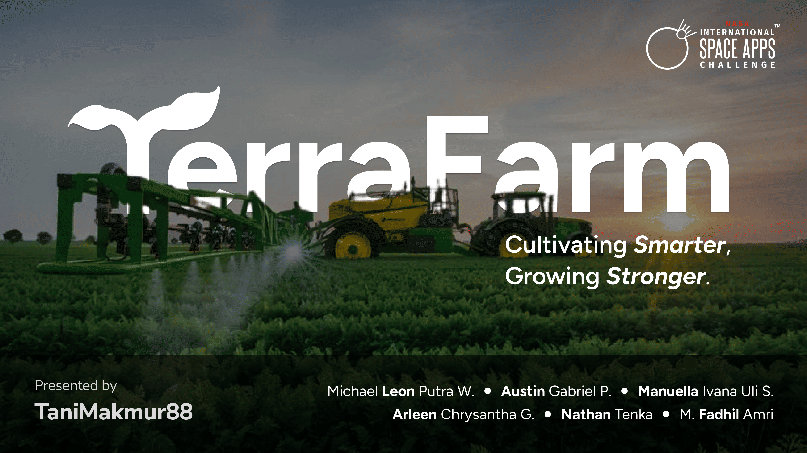

<br>
<div align="center">
    <div >
        
    </div>
    <div>
            <h3><b>TerraFarm</b></h3>
            <p><i>Cultivating Smarter, Growing Stronger.</i></p>
    </div>      
</div>
<br>
<h1 align="center">TerraFarm RAG (Retrieval-Augmented Generation)</h1>
<div align="center">



</div>
<br>
<i>Smart, context-aware recommendations</i>: TerraFarm’s Retrieval-Augmented Generation system takes data-driven farming to the next level by generating personalized action plans and resource optimizations. Leveraging both AI models and community insights, it tailors advice to each farmer’s unique situation, offering real-time, proactive guidance that improves farming efficiency and sustainability.

## 👨🏻‍💻 &nbsp;Technology Stack

<div align="center">
<a href="https://react.dev/">
<kbd>

</kbd>
</a>

<a href="https://www.typescriptlang.org/">
<kbd>

</kbd>
</a>

<a href="https://tailwindcss.com/">
<kbd>

</kbd>
</a>

<a href="https://tailwindcss.com/">
<kbd>

</kbd>
</a>

</div>
<div align="center">
<h4>Gemini | OpenAI Whisperer | Elevenlabs | Django</h4>
</div>
<br>

## ⚙️ &nbsp;How to Run

1. **Clone the Repository**  
   Open your terminal and run the following command to clone this repository:

    ```bash
   $ git clone https://github.com/TerraFarm-TaniMakmur88/TerraFarm_RAG.git
   ```


2. **Run the Server**  
   Ensure that Docker Desktop is installed on your machine. Then, navigate to the project folder and run the following command to build and start the Docker containers:

    ```bash
   $ docker compose up --build
   ```


3. **Access the Server**  
   Once the server is running, you can access the TerraFarm ML service by navigating to the following URL in your browser:

   [http://localhost:8000](http://localhost:8000)

   You should see the server up and running, confirming that the backend is ready.


## 📊 &nbsp;Dataset Overview

The system leverages a knowledge base stored in the knowledge-based folder. This data repository includes key information related to farming best practices, weather patterns, soil conditions, and more, ensuring the AI model provides accurate, actionable insights.

We utilized NASA’s Earth observation data, focusing on weather-related challenges in farming, integrated with localized data about crops, soil health, and pests. The combination of real-time data with static knowledge allows TerraFarm to offer personalized, context-driven recommendations.

## 🌾 &nbsp;Project Overview

TerraFarm is a **conversational AI agro-assistant** designed to empower farmers with real-time insights powered by NASA data. Our solution helps farmers make **informed decisions** about what actions to take, when, and why, especially in unpredictable weather conditions. 

Key Technologies:
- **RAG (Retrieval-Augmented Generation)**: Provides precise, context-based recommendations.
- **Gemini 3.5 Pro**: Delivers cutting-edge decision-making accuracy.
- **OpenAI Whisper**: Converts farmers' voice inputs into text for seamless interaction.
- **ElevenLabs**: Generates natural, human-like responses, ensuring an intuitive and empathetic conversation experience.

### Key Features:
- **Real-time Insights**: Using NASA-powered data, TerraFarm keeps farmers up-to-date with the latest weather changes and crop conditions.
- **Human-Centered Design**: We focus on making the assistant not only functional but also empathetic, understanding farmers' needs and concerns.
- **Seamless Voice Interaction**: The voice-to-text and text-to-voice integration allows farmers, even in remote areas with limited access to technology, to easily interact with the system.

### How it Works:
1. **Voice Input**: Farmers can ask questions or report issues by speaking directly to the assistant.
2. **Data Processing**: The system uses OpenAI Whisper to convert the voice input to text, followed by RAG + Gemini 3.5 Pro for data retrieval and decision-making.
3. **Response Generation**: The response is generated based on the latest insights and delivered back to the farmer in human-like speech through ElevenLabs.

## 👥 &nbsp;Contributors
| <div align="center"><a href="https://github.com/mikeleo03"></a></div> | <div align="center"><a href="https://github.com/arleenchr"></a></div> | <div align="center"><a href="https://github.com/AustinPardosi"></a></div> |
| ---------------------------------------------------------------------------------------------------------------------------------------------------------------------------------------------------------------------------------- | ----------------------------------------------------------------------------------------------------------------------------------------------------------------------------------------------------------------------------------- | ----------------------------------------------------------------------------------------------------------------------------------------------------------------------------------------------------------------------------- |
| <div align="center"><h3><b><a href="https://github.com/mikeleo03">Michael Leon Putra Widhi</a></b></h3><i><p>Bandung Institute of Technology</i></p></div>                                                                                        | <div align="center"><h3><b><a href="https://github.com/arleenchr">Arleen Chrysantha Gunardi</a></b></h3></a><p><i>Bandung Institute of Technology</i></p></div>                                                               | <div align="center"><h3><b><a href="https://github.com/AustinPardosi">Austin Gabriel Pardosi</a></b></h3></a><p><i>Bandung Institute of Technology</i></p></div>                                                                            
| <div align="center"><a href="https://github.com/Nat10k"></a></div> | <div align="center"><a href="https://github.com/manuellaiv"></a></div> | <div align="center"><a href="https://github.com/Mehmed13"></a></div> |
| <div align="center"><h3><b><a href="https://github.com/Nat10k">Nathan Tenka</a></b></h3><i><p>Bandung Institute of Technology</i></p></div>                                                                                        | <div align="center"><h3><b><a href="https://github.com/manuellaiv">Manuella Ivana Uli Sianipar</a></b></h3></a><p><i>Bandung Institute of Technology</i></p></div>                                                               | <div align="center"><h3><b><a href="https://github.com/Mehmed13">Muhammad Fadhil Amri</a></b></h3></a><p><i>Bandung Institute of Technology</i></p></div>                                                                            |